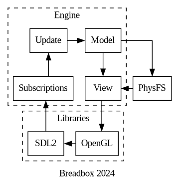

# The Breadbox Engine

The perfect game engine for 1996!

The Breadbox Engine is designed with the intention of running on old/low-powered hardware to prove that you don't need to have the latest and greatest hardware to have fun.

## Target Requirements

| Category   | Minimum Requirements                            |
| ---------- | ----------------------------------------------- |
| OS         | Windows 95 or greater                           |
| Processor  | Intel Pentium or greater                        |
| Memory     | DDR 128 MB or greater                           |
| Graphics   | ATI 3D Rage II or greater (OpenGL 1.x required) |
| Hard Drive | 700 MB of free disk space                       |
| Sound Card | Creative Sound Blaster 16 or greater            |

## Engine Design

The engine's design is based on the [Elm architecture](https://guide.elm-lang.org/architecture/), which uses message passing to manipulate the engine's model. This is extremely helpful for multiplayer games since messages can be transported across the network quickly and easily. This concept combined with deterministic update logic results in a multiplayer experience where players can enjoy the game even if their bandwidth has been severely limited(down to about 56kbps).

